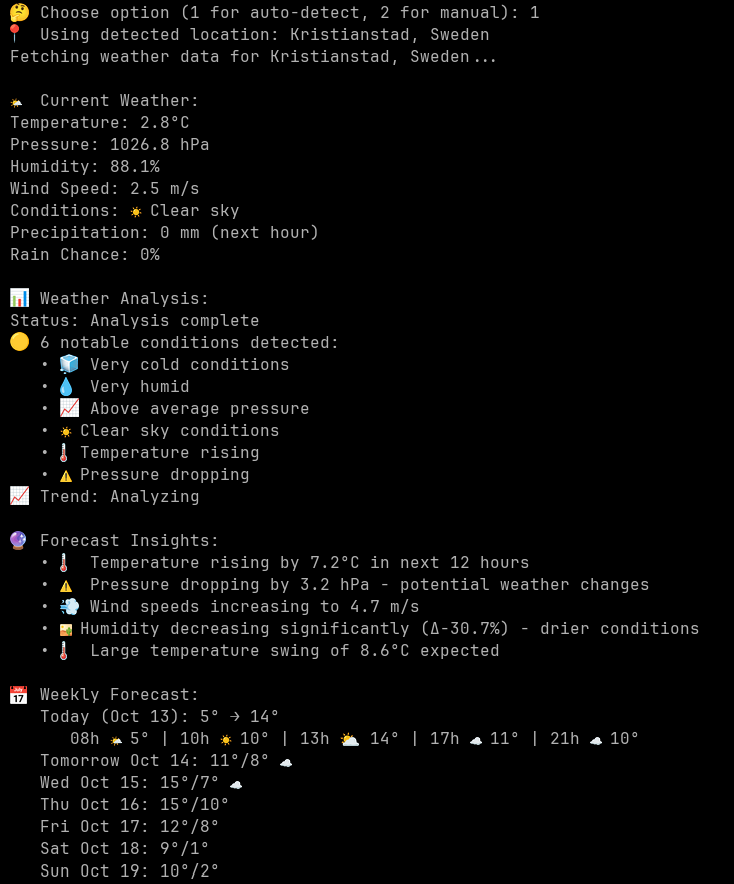

# Weather Intelligence System

**A Developer's Journey: Making Python and Go Talk, with an Analyzing Mind**

## The Story of My Growth as a Developer

Everyone who wants to become a developer makes a weather app — but what I wanted to do here is make Python and Go talk, and have an analyzing mind. This project represents my journey from a simple weather app to a sophisticated intelligence system, where I learned to make two different languages communicate seamlessly.

I was successful in my ambitious goal, and this project showcases my growth as a developer. I have always quit writing code when I needed to design GUIs, so I decided to build everything in the terminal — a choice that focused my attention on the core logic rather than flashy interfaces.

## My Journey Through This Project

Along the way, I learned:

- **How to make Python and Go communicate** through JSON files and subprocess calls
- **Advanced JSON handling** — saving data in JSON format, parsing it, and defining structures in different languages
- **Better use of Go routines** for concurrent weather data collection
- **Data persistence and intelligent caching systems** using JSON files
- **Internationalization** by handling Unicode location names (Cyrillic, Chinese, etc.)
- **System architecture design** with microservices approach
- **Real-world API integration** with proper error handling and rate limiting

I'm aware the idea of Go and Python together is actually complicated, but it was on purpose. I wanted to make them talk, and I did. Working with JSON for all data exchange made me realize there are more sophisticated storage solutions like MongoDB that I may explore in the future.

## Demo Video

Check out the system in action:

[](https://www.youtube.com/watch?v=UqCSYMbkgXw)

## Visual Overview


*Weather Intelligence System main interface with natural language queries*


*System architecture showing Python-Go communication flow*

## Technical Architecture

The system is designed as a hybrid application combining Python's data science capabilities with Go's performance for real-time weather analysis and pattern recognition.

### High-Level Architecture

```
[Weather APIs] ──┐
                 ├──→ [Go Data Collector] ⇄ [JSON Files] ⇄ [Python Core] → [Go Pattern Engine]
[Local Sensors] ─┘                      (Concurrent)      (CS50)           (Analysis)
```

Or in a more detailed form:

```
                    ┌─────────────────┐    ┌──────────────┐    ┌─────────────┐
┌─────────────┐     │  Go Data        │    │  Integration │    │   Python    │
│   Weather   │────→│  Collector      │────→│   Files      │←───│   Core      │
│    APIs     │     │ (Concurrent     │    │ (JSON)       │    │ (CS50       │
│ (met.no,    │     │  Processing)    │    │              │    │  Project)   │
└─────────────┘     └─────────────────┘    └──────────────┘    └─────────────┘
                                                   │
                                                   ▼
                                            ┌──────────────┐
                                            │  Go Pattern  │
                                            │  Engine      │
                                            │ (Analysis)   │
                                            └──────────────┘
```

The two-way arrows (⇄) between Go Data Collector, JSON Files, and Python Core illustrate the bidirectional communication that enables Python and Go to talk seamlessly.

### Key Features

- **Dynamic Location Lookup**: Supports any city worldwide via geocoding
- **Natural Language Input**: Accept queries like "What's the weather in Paris?"
- **Location Detection**: Optional automatic location detection via IP geolocation
- **Smart Caching**: Multi-layer caching system (location coordinates, weather data, historical analysis)
- **Concurrent Processing**: Go routines for collecting weather data from multiple locations simultaneously
- **Intelligent Analysis**: Pattern recognition and anomaly detection for weather data
- **Terminal User Interface**: Clean, efficient interface without GUI complexity
- **Cross-Language Integration**: Seamless communication between Python and Go services

## Installation

**Prerequisites:** Before installing, ensure you have Python 3.x, Go, and Git installed on your system.

The Weather Intelligence System can be installed using one of the following methods:

### Quick Install (Recommended)

You can install the Weather Intelligence System directly using curl, wget, or PowerShell:

**On Linux/macOS using curl:**
```bash
curl -fsSL https://raw.githubusercontent.com/redsskull/weather-intelligence-system/main/install.sh | bash
```

**On Linux/macOS using wget:**
```bash
wget -qO- https://raw.githubusercontent.com/redsskull/weather-intelligence-system/main/install.sh | bash
```

**On Windows using PowerShell:**
```powershell
iex (iwr https://raw.githubusercontent.com/redsskull/weather-intelligence-system/main/install.ps1 -UseBasicParsing)
```

### Manual Installation

1. Clone the repository:
```bash
git clone https://github.com/redsskull/weather-intelligence-system.git
cd weather-intelligence-system
```

2. Set up a virtual environment and install dependencies:
```bash
python -m venv venv
source venv/bin/activate  # On Windows, use: venv\\Scripts\\activate
pip install --upgrade pip
pip install -r requirements.txt
```

3. Install Go dependencies and build Go components:
```bash
cd go-components/data-collector && go build -o ../../data-collector && cd ../..
cd go-components/pattern-engine && go build -o ../../pattern-engine && cd ../..
```

4. Run the project:
```bash
python project.py
```

## Safety Features

Our installation script includes several safety measures to protect your system:

1. **No Root Privileges Required**: The installer does not require sudo and installs only to user-writable directories.

2. **Safe Directory Selection**: The installer checks for user-writable directories first (`~/.local/bin`, `~/bin`) before creating any directories.

3. **Isolated Installation**: All application files are installed to `~/.local/share/weather-intelligence-system`, keeping them separate from system files.

4. **PATH Modification Only to User Directories**: The installer only adds entries to your PATH that point to directories in your home folder.

5. **Prerequisite Checks**: The installer verifies that Python, Go, and Git are installed before proceeding.

6. **Virtual Environment Isolation**: Python dependencies are installed in a dedicated virtual environment to avoid system-wide package conflicts.

7. **Cleanup on Failure**: If the installation fails, temporary files are cleaned up automatically.

## Prerequisites

**Before running the installation script, you must have the following tools installed on your system:**

- **Python 3.x** (with pip)
- **Go** (latest stable version)
- **Git** (for downloading and building Go components)

The installation script will check for these prerequisites and exit with an error message if any are missing.

- **On Linux/macOS:**
  - A Unix-like operating system (Linux/macOS)
- **On Windows:**
  - PowerShell 5.1 or later

## What the Installation Does

**On Linux/macOS:**
1. Creates the installation directory at `~/.weather-intel` containing all application files
2. Downloads the source code, builds the Go components (requires Git), and stores the compiled binaries in the installation directory
3. Creates and sets up a Python virtual environment (venv) for isolated dependencies
4. Installs the `weather` and `weather-uninstall` commands to `~/.local/bin`
5. The `weather` command runs the application from within the virtual environment

**On Windows:**
1. Creates the installation directory at `$env:USERPROFILE\\.weather-intel` containing all application files
2. Downloads the source code, builds the Go components (requires Git), and stores the compiled binaries in the installation directory
3. Creates and sets up a Python virtual environment (venv) for isolated dependencies
4. Installs the `weather` command script to `$env:USERPROFILE\\.local\\bin`
5. Automatically adds the installation directory to your user PATH environment variable

## Post-Installation

**On Linux/macOS:**
After installation, you may need to restart your terminal or run the appropriate source command for your shell to update your PATH:

- For bash users: `source ~/.bashrc` or `source ~/.bash_profile`
- For zsh users (default on macOS): `source ~/.zshrc` or `source ~/.zprofile`
  - On macOS, it's often `.zprofile` that exports PATH variables
- Or simply restart your terminal

## Installed Files

The complete Weather Intelligence System is installed in a dedicated directory:
- **On Linux/macOS:** `~/.weather-intel`
- **On Windows:** `$env:USERPROFILE\\.weather-intel`

This directory contains:
- All Python source files (project.py, requirements.txt, utils/, etc.)
- Compiled Go binaries (data-collector, pattern-engine)
- A dedicated Python virtual environment with all dependencies
- Data cache and integration directories

The system is completely self-contained in this directory and doesn't modify any system-wide directories.

**On Windows:**
The installer automatically updates your user PATH environment variable. You may need to restart your PowerShell session to use the `weather` command directly.

Then you can run:
```bash
weather
```

## Uninstall

**On Linux/macOS:**
You can uninstall using the uninstall command:
```bash
weather-uninstall
```
Or manually remove:
- The installation directory: `~/.weather-intel`
- The installed binary: `~/.local/bin/weather`
- The uninstall binary: `~/.local/bin/weather-uninstall`

**On Windows:**
You can uninstall using the uninstall command:
```powershell
weather-uninstall
```
Or manually remove:
- The installation directory: `$env:USERPROFILE\\.weather-intel`
- The installed scripts: `$env:USERPROFILE\\.local\\bin\\weather.ps1` and `$env:USERPROFILE\\.local\\bin\\weather-uninstall.ps1`
- The PATH entry from your user environment variables

## Key Data Structures

### Weather Data Structure
```json
{
  "location": {
    "latitude": 59.9139,
    "longitude": 10.7522,
    "name": "Oslo, Norway"
  },
  "timestamp": "2025-09-26T15:00:00Z",
  "current": {
    "temperature": 16.0,
    "pressure": 1020.8,
    "humidity": 56.8,
    "wind_speed": 3.7,
    "wind_direction": 93.1,
    "cloud_cover": 100.0,
    "conditions": "cloudy"
  },
  "forecast": {
    "next_1h": {
      "precipitation": 0.0,
      "symbol": "cloudy"
    },
    "next_6h": {
      "precipitation": 0.1,
      "symbol": "partly_cloudy"
    }
  }
}
```

### Go Concurrent Collection Example
```go
func FetchConcurrently(urls []string) <-chan WeatherResponse {
    responses := make(chan WeatherResponse, len(urls))

    for _, url := range urls {
        go func(u string) {
            resp, err := http.Get(u)
            responses <- WeatherResponse{Response: resp, Error: err}
        }(url)
    }

    return responses
}
```

## The Philosophy Behind My Work

I'm not here to make things pretty (as a matter of fact, I'm terrible at it. If anyone wants to make a GUI for this be my guest) - I'm here to make them **think**. My passion lies deep in the brain of systems, not in their surface appearance. I want to understand how minds work - both human and machine. I build the engines, not the paint jobs. This project is a perfect example of focusing on the intelligence and functionality rather than visual aesthetics.

### My Core Stack Purpose
- **Go** - 🧠 The Nervous System (fast, concurrent, reliable)
- **Python** - 🤖 The Learning Center (AI, patterns, decisions)
- **JSON** - 🔄 The Communication Protocol (data exchange format)
- **Bash** - 🔧 The Body (real-world interfaces)

## The Journey Continues

This project is more than just a weather app — it's a demonstration of my ability to tackle complex challenges, integrate multiple technologies, and build intelligent systems. It represents my growth from someone who would quit at GUI development to someone who can architect sophisticated distributed systems that make different languages talk to each other.

The skills I developed through this project - concurrent programming, cross-language integration, JSON data manipulation, system architecture, and intelligent caching - form the foundation for my journey toward building truly intelligent systems that don't just compute, but think, feel, and surprise us with their own intelligence.

## Contributing

I welcome contributions that enhance the intelligence of this system. Whether it's improving the pattern recognition algorithms, adding new weather APIs, or creating more sophisticated Go services, every enhancement brings us closer to truly intelligent weather analysis.

## Acknowledgments

- Special thanks to [ForrestKnight](https://www.youtube.com/@ForrestKnight) for the original idea, which you can see in this video: [https://www.youtube.com/watch?v=zX4u3SudI-0](https://www.youtube.com/watch?v=zX4u3SudI-0)
- Thanks to Qwen for teaching me things when I didn't know them and helping me understand complex concepts

## License

This project reflects my journey as a developer and is shared with the community to inspire others to tackle complex challenges and integrate different technologies in innovative ways.
